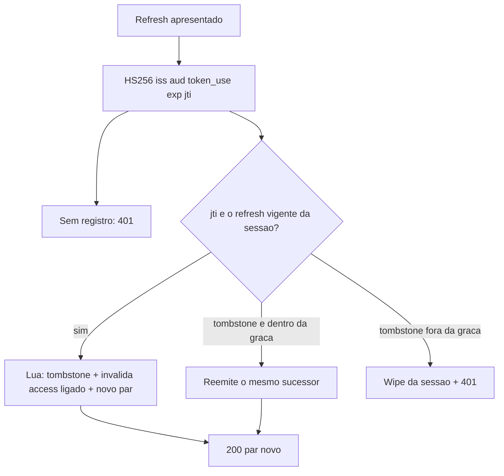

# Proposta: API `/tokens`

**Status:** **parcialmente implementada**. A primeira entrega cobre as seções 1 a 7, 10, 11 e 13: `POST /tokens/signin`, `POST /tokens/refresh`, sessões e rotação atômica no Redis, validação do Bearer contra o store e a remoção de `POST /profiles/signin` e `POST /profiles/refresh`. O contrato vigente está em [`docs/api/tokens.md`](../api/tokens.md).

**Pendente:** `GET /tokens` e `POST /tokens/signout` (seções 8 e 9), os campos `client` e `location` da listagem, o limite de tentativas com **429** e `Retry-After`, e os eventos de conta da [seção 12](#12-eventos-de-conta) (wipe ao trocar a senha e ao excluir o perfil). Enquanto não vierem, a sessão só termina por expiração (inatividade ou teto absoluto), por evicção no teto de sessões ou por reuso de refresh fora da graça.

Query opcional **`lang`**: `en` (padrão), `pt` ou `es`. Omitida, vazia ou não suportada → inglês. Sem sessão HTTP e sem `Accept-Language`.

Este documento trata **somente** de `/tokens`. Não redefine CRUD de perfil, checkers, authorities nem notes. A regra de validade do access Bearer (assinatura HS256 + `iss`/`aud`/`exp` + registro ativo no Redis) aplica-se a qualquer uso do access token; as demais rotas da API não são enumeradas aqui. Eventos de conta (troca de senha, exclusão) **devem** revogar sessões — invariantes na [seção 12](#12-eventos-de-conta), sem redesenhar esses endpoints.

Todas as respostas de `/tokens` (2xx, 4xx e 5xx) levam `Cache-Control: no-store`.

---

## 1. Objetivo

Substituir o par JWT emitido em `POST /profiles/signin` e `POST /profiles/refresh` (stateless, `sub` = id do perfil, refresh com `exp`, sem store) por um recurso `/tokens` em que:

- a autenticação continua sendo e-mail/senha **ou** refresh;
- o access expira; o refresh **também** (idle + teto absoluto da sessão);
- Redis é a fonte de verdade para existência, listagem, rotação e saída de sessão;
- o payload JWT identifica o **token** (UUIDv7), não o perfil;
- o cliente pede refresh só se quiser, no signin; no endpoint de refresh o novo refresh é obrigatório;
- refresh usado uma vez invalida a si e ao access associado (rotação **atômica**); retry na janela de graça não dispara wipe;
- listagem e saída (`signout`) são por **sessão de login** (um item por dispositivo/login), não por JWT;
- encerrar **outra** sessão exige a senha do perfil (step-up); sair só da sessão corrente basta o Bearer.

---

## 2. Princípios

1. **JWT continua sendo o credencial** que o cliente envia. A assinatura HS256 (algoritmo **pinado no servidor**, sem confiar no `alg` do header; rejeitar `none` e assimétrico) e as claims (`iss`, `aud`, `token_use`, `exp`, `jti`) são verificadas primeiro. Decoders **distintos**: access exige `token_use=access` e `exp`; refresh exige `token_use=refresh` e `exp`. Não reutilizar um único `JwtValidators.createDefault()` para os dois tipos.
2. **Presença ativa no Redis decide se o token ainda vale.** Assinatura válida com registro ausente ou não ativo = inválido. É assim que o signout (e a rotação) invalidam o acesso. Refresh válido só se o `jti` for o **vigente da sessão**, não um registro órfão.
3. **Não persistir a string compacta do JWT** no Redis. Depois da verificação criptográfica, o `jti` (e, na graça, as claims do sucessor) bastam. Guardar o compacto aumenta a superfície se o Redis vazar e é redundante. Não logar compacto JWT, header `Authorization`, `refreshToken` nem senha.
4. **Fail closed.** Redis indisponível: não emitir token sem gravar; não aceitar Bearer sem consultar. Resposta **503**, não 401 (401 sugere credencial ou token ruim).
5. **Um signin = uma sessão** (`sessionId` UUIDv7 / família). Signin sem refresh ainda cria sessão (só access). Signins sucessivos geram sessões independentes. Rotação permanece na **mesma** sessão: o `sessionId` **não** muda (o relógio do login está nos 48 bits de tempo do UUIDv7).
6. **O que autentica é registro ativo.** Tombstone de refresh consumido existe no Redis para detectar reuso, não autentica e **não** aparece em `GET /tokens`. TTL do tombstone **≥** vida absoluta restante da sessão; não apagar tombstone enquanto um par mais novo da mesma família ainda puder autenticar.
7. **Vida limitada.** Access tem `exp`. Refresh e sessão têm idle (`sajitar.security.jwt.refresh-expiration-seconds`) **e** máximo absoluto desde o signin (`sajitar.security.jwt.session-max-seconds`). Rotação é **atômica** (um round-trip Redis / script Lua). Retry na janela de graça **não** dispara wipe.
8. **Redis desta proposta é instância dedicada** a sessões e tokens de `/tokens`. TLS, AUTH e ACL são **requisito do mecanismo**, não detalhe de Compose. Outro propósito de Redis, se existir, usa **outra** instância.
9. **Principal autenticado = `profileId` do Redis.** Se a stack exigir `sub`, `sub` = `jti`. **Nunca** tratar `sub` como id de perfil.

---

## 3. Formato do token

Algoritmo **HS256**, claim `token_use`: `access` | `refresh`. Refresh JWT **não** vale no header `Authorization`.

| Claim | Access | Refresh |
| --- | --- | --- |
| `jti` | UUIDv7 aleatório do token | idem |
| `token_use` | `access` | `refresh` |
| `iat` | instante de emissão | idem |
| `exp` | `iat` + `sajitar.security.jwt.expiration-seconds` | `min(agora + idle, nascimento da sessão + session-max)` |
| `iss` | `sajitar.security.jwt.issuer` | igual |
| `aud` | `sajitar.security.jwt.audience` | igual |
| `sub` | omitido; se a stack exigir sujeito, `sub` = `jti` | idem |

O **id do perfil não entra no payload**. Fica só no registro Redis chaveado por `jti`. O **id da sessão também não entra no JWT**; vai na resposta JSON (`sessionId`) e no Redis.

O decoder exige `iss` e `aud` iguais às propriedades (strings não vazias).

### Propriedades (`sajitar.security.jwt`)

Invariante: `session-max-seconds` > `refresh-expiration-seconds` > `expiration-seconds` > 0.

| Propriedade | Papel | Padrão |
| --- | --- | --- |
| `expiration-seconds` | `exp` do access | 3600 |
| `refresh-expiration-seconds` | idle do refresh/sessão (desliza a cada refresh bem-sucedido) | 604800 |
| `session-max-seconds` | teto absoluto desde o signin (`sessionId` UUIDv7) | 2592000 |
| `max-sessions-per-profile` | teto de sessões ativas por perfil | 10 |
| `refresh-grace-seconds` | janela em que retry do refresh antigo reemite o sucessor (0 = qualquer tombstone dispara wipe) | 15 |
| `issuer` | claim `iss` | string não vazia |
| `audience` | claim `aud` | string não vazia |

Cada refresh **bem-sucedido** desliza o idle, **sem** ultrapassar `timestamp(sessionId) + session-max-seconds`.

---

## 4. Redis

### 4.1. O que se grava

Por `jti` ativo: `profileId`, tipo (`access` | `refresh`), `sessionId` (família), `linkedId` (jti do irmão no par, se houver). Sem `issuedAt`: o `jti` é UUIDv7. Access leva **TTL Redis igual ao `exp` restante** (o registro some sozinho quando o JWT já não valeria). Refresh e registro de sessão levam TTL igual ao restante até o `exp` do refresh vigente **ou** até o máximo absoluto — o que for menor.

Por sessão ativa: `profileId`, `jti` do access vigente e do refresh vigente (este último ausente se o signin foi só com access), `client` (User-Agent parseado) e `location` (GeoIP na gravação). Sem `createdAt`: o `sessionId` é UUIDv7 gerado no signin e **nunca** regenerado na rotação. `client` e `location` nascem no signin e **atualizam no refresh** (mesmo `sessionId`; IP/UA daquela requisição). Não se grava IP nem UA cru para devolver na API; o lookup de GeoIP usa o IP só no servidor (`X-Forwarded-For` apenas se o proxy da frente for confiável).

Sessão só com access: vive até o `exp` do access, `POST /tokens/signout` dessa sessão, evicção por teto ou TTL Redis. **Conta no teto** de sessões por perfil.

Índice por perfil: conjunto dos `sessionId` ativos, para `GET /tokens` e para o teto.

Índice por sessão: tokens ativos da sessão + tombstones dos refresh já consumidos daquele encadeamento.

Tombstone: sessão + `jti` consumido + claims do par **sucessor** (`jti`, `iat`, `exp`, `iss`, `aud`, `token_use` de access e refresh) para reemitir na graça; instante da rotação. TTL = vida absoluta **restante da sessão** (não menor que o refresh vigente). Depois que a sessão já teria morrido, reuso é só 401 — wipe seria no-op.

### 4.2. Validade

| Situação | Access | Refresh |
| --- | --- | --- |
| Assinatura inválida / `alg` não pinado / `iss`/`aud` errados / `token_use` errado / JWT malformado | inválido | inválido |
| `exp` vencido | inválido | inválido |
| Sem registro ativo no Redis | inválido | inválido |
| Registro ativo cujo `jti` **não** é o vigente da sessão (órfão) | inválido | inválido |
| Tombstone dentro da graça | — | não autentica como vigente; **reemite** o sucessor (200) |
| Tombstone fora da graça | — | não autentica; dispara wipe da sessão |
| Registro vigente da sessão e demais checagens ok | válido | válido |

Resolução do perfil: ler `profileId` no registro do `jti`. Perfil ausente no PostgreSQL trata-se como token inválido no signin/refresh (mesmo mapa de erro do token), sem revelar o motivo.

### 4.3. Operação

- A instância Redis de `/tokens` é **exclusiva** deste propósito (fonte de verdade das sessões, fail closed, TTL de refresh/sessão/tombstone). Não compartilhar o processo com outro papel: eviction, `FLUSH` e persistência desta instância não podem servir a uso distinto.
- Se for necessário Redis para outro propósito, **cria-se outra instância**. Prefixo de chave ou database Redis na mesma instância não isolam memória, eviction, AUTH nem ACL.
- **TLS**, **AUTH** e ACL mínima (só o que `/tokens` precisa) são obrigatórios nesta instância. Rede fechada (não expor à internet). Comprometer escrita no Redis permite remapear `profileId` de um `jti` ainda válido.
- Política de memória: `maxmemory-policy noeviction` (ou memória com folga equivalente). TTL e teto de sessões limitam o crescimento; LRU nesta instância ainda apagaria sessões válidas.
- Persistência (AOF e/ou RDB) é **recomendada**. Restart sem persistência = revogação em massa de todos os tokens. Disco/backup com AOF trata-se como segredo (há `profileId` e localização de login).
- Restart com persistência preserva refresh/sessão cujo TTL ainda não estourou e access cujo TTL ainda não estourou.
- Compose, CI e URLs de conexão **não** cabem neste arquivo; TLS/AUTH/ACL **cabem**.

---

## 5. Endpoints

`POST /tokens/signin` e `POST /tokens/refresh` são **públicos**: `Authorization` Basic ou Bearer inválido é **ignorado**. `GET /tokens` e `POST /tokens/signout` exigem access Bearer **válido no Redis**. Bearer ausente ou inválido nessas duas → **401** `{token:[…]}`. Signout de sessão que **não** é a corrente exige ainda a senha no body ([seção 9](#9-post-tokenssignout)).

| Método | Caminho | Auth | Sucesso |
| --- | --- | --- | --- |
| POST | `/tokens/signin` | público | 200 + access, `sessionId`; refresh só se pedido |
| POST | `/tokens/refresh` | público | 200 + par (novo ou o sucessor na graça), mesmo `sessionId` |
| GET | `/tokens` | Bearer access | 200 + sessões ativas do perfil |
| POST | `/tokens/signout` | Bearer access (+ senha se `ids` incluir outra sessão) | 204 se todos os ids forem sessões ativas do Bearer; 404 se algum não for (nada encerrado) |

`POST /tokens/signout` (não `DELETE` com corpo) evita clientes e proxies que descartam body em `DELETE`. Simétrico a `POST /tokens/signin`: entrar cria sessão; sair encerra uma ou mais sessões.

Não há paginação por cursor: o teto `max-sessions-per-profile` limita o volume ao de dispositivos, não ao de catálogo.

---

## 6. `POST /tokens/signin`

Cria uma **sessão** e um access. Refresh só se o cliente pedir.

Antes de gravar: se o perfil já tem `max-sessions-per-profile` sessões ativas, **encerra a mais antiga** (menor timestamp nos 48 bits do `sessionId` UUIDv7: access, refresh e tombstones dessa família) e segue. Resposta **200** com a sessão nova; sem campo extra e sem erro.

### Pedido

```json
{
  "email": "alice@example.com",
  "password": "senhaSegura1",
  "refresh": true
}
```

| Campo | Regra |
| --- | --- |
| `email`, `password` | obrigatórios; mesmas validações de credencial já usadas no signin atual |
| `refresh` | opcional; omitido ou `false` → sessão só com access; `true` → par na mesma sessão |

### Resposta 200 — sem refresh

```json
{
  "token": "eyJ...",
  "type": "Bearer",
  "expiresIn": 3600,
  "id": "018f3c2a-7b00-7c3d-9e1a-000000000001",
  "sessionId": "018f3c2a-7b00-7c3d-9e1a-000000000010"
}
```

`id` é o `jti` do access (UUIDv7 da emissão deste token). `sessionId` é UUIDv7 da **sessão**, gerado no signin, distinto dos `jti`. Sem `refreshToken`, `refreshId` nem `refreshExpiresIn` (campos **omitidos**, não `null`).

### Resposta 200 — com `refresh: true`

```json
{
  "token": "eyJ...",
  "type": "Bearer",
  "expiresIn": 3600,
  "id": "018f3c2a-7b00-7c3d-9e1a-000000000001",
  "sessionId": "018f3c2a-7b00-7c3d-9e1a-000000000010",
  "refreshToken": "eyJ...",
  "refreshId": "018f3c2a-7b00-7c3d-9e1a-000000000002",
  "refreshExpiresIn": 604800
}
```

Os dois `jti` ficam ligados (`linkedId` um do outro) na mesma sessão. `refreshExpiresIn` é o restante até o `exp` daquele refresh (idle limitado pelo teto absoluto).

### Erros

| HTTP | Corpo | Quando |
| --- | --- | --- |
| 400 | mapa campo→mensagens | validação (e-mail, senha, tipo de `refresh`) |
| 401 | `{credentials:[…]}` | e-mail inexistente ou senha não confere |
| 403 | `{email:[…]}` | perfil com checker `VERIFY_EMAIL` |
| 429 | `{credentials:[…]}` | limite de tentativas; header `Retry-After`. Por IP e, se o e-mail vier no body, também por e-mail. **Mesmo** quando o e-mail não existe (não enumerar). O número do limite é configurável; o contrato fixa o status e o mapa |
| 503 | (indisponibilidade) | Redis fora do ar; não emitir JWT sem gravar |

---

## 7. `POST /tokens/refresh`

Troca um refresh **vigente da sessão** por um **novo par**, ou reemite o sucessor se o token estiver na janela de graça. Corpo apenas; **não** usar `Authorization`.

### Pedido

```json
{
  "refreshToken": "eyJ..."
}
```

`refreshToken` obrigatório e não em branco.

### Resposta 200

Access **e** refresh (mesmo formato da resposta de signin com `refresh: true`, inclusive `refreshExpiresIn`). O par permanece na **mesma sessão**: o `sessionId` **não** muda. Numa rotação nova, os `id` / `refreshId` são os **novos** `jti`. Na graça, são os `jti` **já emitidos** na rotação anterior (mesmo compacto reconstruído).

### Rotação (atômica)

Um único round-trip Redis (script Lua / transação equivalente). Não há janela em que dois requests vejam o mesmo refresh como vigente.



No sucesso de uma rotação **nova**:

1. O refresh apresentado deixa de ser vigente.
2. O access que estava ligado a ele (`linkedId`) deixa de ser ativo — mesmo que o JWT desse access ainda não tenha expirado.
3. Grava-se **tombstone** do refresh consumido (sessão + `jti` + claims do sucessor + instante da rotação); não aparece em `GET /tokens`.
4. Emite-se e grava-se o novo par na mesma sessão (idle deslizado, limitado pelo teto absoluto).

O refresh antigo **fora da graça** não autentica de novo. O access antigo **não** vale mais no Bearer.

### Graça (retry)

Se o refresh apresentado for tombstone e `agora - instante da rotação` < `refresh-grace-seconds`:

- **não** há wipe;
- resposta **200** com o **mesmo** par sucessor;
- o compacto **não** está no Redis: reconstrói-se com HMAC (determinístico) a partir das claims gravadas (`jti`, `iat`, `exp`, `iss`, `aud`, `token_use`).

`refresh-grace-seconds = 0`: qualquer tombstone dispara wipe. O padrão é graça > 0 (retry de cliente móvel / aba duplicada).

### Reuso (furto)

Se o refresh apresentado for tombstone **fora** da graça:

1. Apagam-se todos os tokens **ativos** dessa sessão (access e refresh vigentes, inclusive o par que o ladrão tenha obtido na rotação anterior) e a sessão deixa a listagem.
2. Tombstones da sessão podem ser limpos em seguida (já não há par vigente a proteger).
3. Resposta **401** `{refreshToken:[…]}` — mesmo mapa de refresh inválido; não distinguir “já usado” de “nunca existiu”.

Refresh inexistente, malformado, assinatura inválida, `iss`/`aud` errados, `token_use` ≠ `refresh`, `exp` vencido, registro vigente ausente, `jti` órfão, ou perfil sumiu no PostgreSQL → o mesmo **401** `{refreshToken:[…]}`.

### Erros

| HTTP | Corpo | Quando |
| --- | --- | --- |
| 400 | mapa campo→mensagens | `refreshToken` ausente ou em branco |
| 401 | `{refreshToken:[…]}` | inválido, reuso fora da graça, perfil sumiu |
| 403 | `{email:[…]}` | perfil com checker `VERIFY_EMAIL` |
| 429 | `{refreshToken:[…]}` | limite de tentativas por IP (abuso de CPU/assinatura); header `Retry-After`. O número é configurável; o contrato fixa o status e o mapa |
| 503 | (indisponibilidade) | Redis fora do ar |

---

## 8. `GET /tokens`

Lista as **sessões de login ativas** do perfil associado ao Bearer (via Redis). **Não** devolve a string JWT nem os `jti`. Um item = um login/dispositivo.

Autenticado com access válido, a lista contém **pelo menos** a sessão corrente. O teto de sessões limita o tamanho de `content`.

O horário do login sai do **`id` da sessão** (UUIDv7): o front lê os 48 bits de tempo Unix (ms) e formata no fuso do usuário. A API **não** envia `createdAt`. **Não** usar o `jti` do JWT para isso — a rotação gera `jti` novo; o `sessionId` é estável.

`client` e `location` são **indícios** (UA e IP podem ser mascarados por VPN ou spoof). Servem para reconhecer um login desconhecido, não como prova forense. O servidor só calcula o que o cliente não deriva do id (parse de UA e GeoIP).

### Resposta 200

```json
{
  "content": [
    {
      "id": "018f3c2a-7b00-7c3d-9e1a-000000000010",
      "current": true,
      "client": {
        "name": "Chrome",
        "os": "Linux",
        "device": "desktop"
      },
      "location": {
        "country": "BR",
        "city": "Recife"
      }
    },
    {
      "id": "018f3c2a-7b00-7c3d-9e1a-000000000020",
      "current": false,
      "client": {
        "name": "Safari",
        "os": "iOS",
        "device": "mobile"
      },
      "location": {
        "country": "BR",
        "city": "São Paulo"
      }
    }
  ]
}
```

| Campo | Regra |
| --- | --- |
| `id` | `sessionId` UUIDv7 (família), **não** o `jti` do JWT. Instante do login = timestamp embutido neste id. |
| `current` | `true` só na sessão do Bearer desta requisição; `false` nas demais. Não deriva do id (depende deste request). |
| `client` | User-Agent parseado **no servidor**: `name` (navegador/app), `os`, `device` (`desktop` \| `mobile` \| `tablet` \| `unknown`). Objeto **omitido** se não houver UA ou se o parse falhar. UA cru **não** vai na resposta. |
| `location` | GeoIP **na gravação** (signin/refresh): `country` (ISO 3166-1 alpha-2), `city`. Objeto **omitido** (ou só `country`, sem `city`) se o lookup falhar. **Sem IP** na resposta. |

Sem `type`, `expiresIn`, `linkedId`, IP, User-Agent cru ou string JWT. `client` e `location` **não** entram no payload JWT.

Não usar 404 para lista “vazia”. Tombstones não entram em `content`.

### Erros

| HTTP | Corpo | Quando |
| --- | --- | --- |
| 401 | `{token:[…]}` | Bearer ausente, inválido, expirado, `iss`/`aud` errados, `token_use` ≠ `access`, ou sem registro ativo no Redis |
| 503 | (indisponibilidade) | Redis fora do ar |

---

## 9. `POST /tokens/signout`

Sai de uma ou mais **sessões** do **próprio** perfil numa única requisição (`ids` = sessões a encerrar, inclusive noutros dispositivos). O status HTTP **é** o recibo: não há corpo nem lista do que saiu.

Bearer **basta** se `ids` for **somente** a sessão do access corrente (incluindo duplicatas desse id). Se **qualquer** id for outra sessão, o body exige `password`.

### Pedido

```json
{
  "ids": [
    "018f3c2a-7b00-7c3d-9e1a-000000000010",
    "018f3c2a-7b00-7c3d-9e1a-000000000020"
  ],
  "password": "senhaSegura1"
}
```

`ids` obrigatório, não vazio; cada elemento é um `sessionId` (UUID). `password` omitido quando `ids` ⊆ {sessão corrente}.

### Ordem

1. Bearer ausente ou inválido → **401** `{token:[…]}`.
2. Validar `ids` (ausente, vazio ou UUID inválido) → **400**.
3. Se algum id **não** é a sessão corrente → `password` obrigatório (ausente ou em branco → **400** `{password:[…]}`).
4. Se a senha é exigida: conferir no perfil do Bearer. Não confere → **401** `{credentials:[…]}` **antes** do 204/404 (não vazar existência de sessão alheia sem a senha).
5. Lote tudo-ou-nada.

Tentativas que enviam senha entram no mesmo tipo de limite que o signin: **429** `{credentials:[…]}` + `Retry-After`.

### Lote tudo-ou-nada

- **204** sem corpo: **todos** os `ids` são sessões **ativas** cujo `profileId` é o do Bearer. O signout ocorre. Inclui a sessão do próprio Bearer, se estiver na lista; daí em diante aquele access não autentica.
- **404** sem corpo: **qualquer** id não é uma sessão ativa sua (inexistente, já encerrada **ou** de outro perfil). **Nenhuma** sessão é encerrada. O mesmo 404 cobre “não existe” e “é de outro usuário” — sem 403, sem enumeração.

Não há 200 nem representação JSON no sucesso.

### Efeito (somente no 204)

Cada id encerrado remove o access **e** o refresh ativos dessa sessão (login encerrado). Não há, neste endpoint, “sair só do access e manter o refresh”. Tombstones da sessão não precisam ser apagados neste passo; reuso posterior de um refresh antigo continua 401 (wipe no-op se já não há ativos).

### Erros

| HTTP | Corpo | Quando |
| --- | --- | --- |
| 400 | mapa campo→mensagens | `ids` ausente, vazio ou UUID inválido; `password` ausente ou em branco quando obrigatória |
| 401 | `{token:[…]}` | Bearer ausente ou inválido |
| 401 | `{credentials:[…]}` | senha exigida e não confere |
| 404 | sem corpo | algum id não é uma sessão ativa do Bearer; nenhuma sessão é encerrada |
| 429 | `{credentials:[…]}` | limite de tentativas com senha; header `Retry-After` |
| 503 | (indisponibilidade) | Redis fora do ar |

---

## 10. Vínculo access ↔ refresh e sessões

```
signin (refresh: false)     →  sessão S1 com um access (sem refresh); conta no teto
signin (refresh: true)      →  sessão S2 com access A1 ↔ refresh R1
signin com teto cheio       →  encerra a sessão mais antiga; 200 com a nova
refresh(R1) vigente         →  A1 e R1 inativos; tombstone R1; ativos A2 ↔ R2 (ainda S2)
refresh(R1) na graça        →  200 com o mesmo par A2 ↔ R2; sem wipe
refresh(R1) fora da graça   →  wipe dos ativos de S2; S2 some do GET; 401
idle ou session-max estoura →  S2 some; refresh/access dessa família deixam de valer
signout(S2) só corrente     →  Bearer basta; remove A2 e R2
signout(outras)             →  exige senha; 204 ou 404 tudo-ou-nada
```

Várias sessões do mesmo perfil convivem (vários dispositivos), até o teto. Wipe, signout, idle, teto absoluto ou evicção numa sessão não afetam as outras.

Sessão só com access (signin sem refresh) vale até o `exp` do access, `POST /tokens/signout` dessa sessão, evicção por teto ou TTL Redis.

---

## 11. Validação do access Bearer

Ordem lógica:

1. Extrair Bearer. Ausente → 401 `{token:[…]}`.
2. Verificar HS256 pinado, `iss`, `aud`, `token_use=access`, `jti` presente, `exp` no futuro.
3. Consultar Redis: registro **ativo** desse `jti` como access **vigente da sessão**. Ausente → 401 `{token:[…]}`.
4. Redis indisponível → 503.
5. O `profileId` do registro é o principal autenticado. Não se lê id de perfil do JWT (`sub` não é perfil).

O access **não** consulta o PostgreSQL a cada request (janela ≤ `expiration-seconds`), **desde que** DELETE do perfil apague as sessões ([seção 12](#12-eventos-de-conta)).

Rotas públicas de `/tokens` (signin e refresh) **não** aplicam essa cadeia ao header: ignoram `Authorization`.

---

## 12. Eventos de conta

Este documento não redesenha PUT/PATCH/DELETE de `/profiles`. Os use cases correspondentes **devem** cumprir:

| Evento | Efeito nas sessões |
| --- | --- |
| Hash de senha **de fato** alterado (PUT/PATCH) | wipe de **todas** as sessões daquele `profileId`, inclusive a corrente |
| DELETE do perfil | wipe **imediato** das sessões (o access não sobrevive até o TTL Redis) |
| Ban ou desativação futura, se existir | o mesmo wipe |

Não há endpoint novo de logout global. O cliente ainda lista (`GET /tokens`) e sai no voluntário (`POST /tokens/signout`), com senha quando a lista inclui outra sessão.

---

## 13. Migração a partir de `/profiles`

Quando esta proposta for implementada:

| Hoje | Passa a |
| --- | --- |
| `POST /profiles/signin` | `POST /tokens/signin` (refresh opt-in no body; `sessionId`; `refreshExpiresIn` só se houver refresh) |
| `POST /profiles/refresh` | `POST /tokens/refresh` (sempre par; mesmo `sessionId`; uso único + graça; `refreshExpiresIn`) |
| par stateless até o `exp` | par com registro Redis, idle, teto absoluto, teto de sessões; listagem e `signout` **por sessão** |
| `sub` = id do perfil | `jti` UUIDv7 do token; `iss`/`aud`; perfil só no Redis |

`POST /profiles/signin` e `POST /profiles/refresh` **deixam de ser** os endpoints JWT. O restante de `/profiles` (CRUD, listagem, details) permanece fora deste documento, salvo as invariantes da [seção 12](#12-eventos-de-conta).

Tokens antigos (`sub` = perfil, sem registro Redis, sem `iss`/`aud`) **falham fechado** na cutover. Não se aceitam os dois formatos ao mesmo tempo.

Clientes que hoje recebem sempre um refresh precisam passar `"refresh": true` no signin. Clientes que só precisam de access de curta duração omitem o campo.

---

## 14. Fora desta proposta

- Compose, CI e URLs/propriedades de *conexão* Redis (host, porta, credencial em env). TLS, AUTH, ACL, instância dedicada e `noeviction` estão **dentro** (seção 4.3).
- Nomes de classes, portas Java, OpenAPI e testes — cabem na entrega de implementação.
- Autorização por dono de recurso (continuar “qualquer access válido opera o recurso” ou não é decisão de `/tokens`).
- Paginação de `GET /tokens` (o teto de sessões limita `content`).
- Provedor de GeoIP, parse de User-Agent e demais libs de infra (a API só fixa o JSON `client` / `location`).
- IP na resposta, apelido editável da sessão, `lastUsedAt`, `createdAt` / `issuedAt` duplicando o UUIDv7.
- Números concretos dos limites 429 (só o status, o mapa e `Retry-After`).
